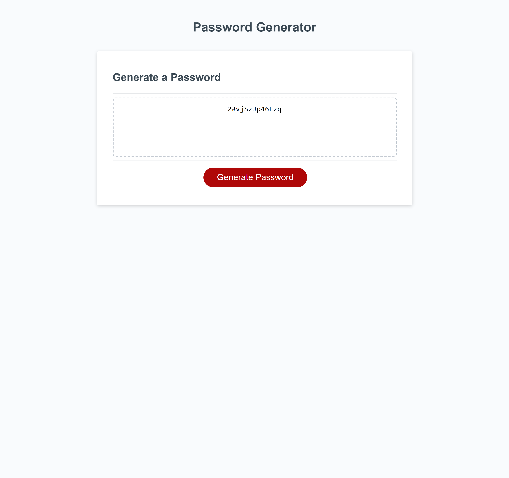

# Password-Generator

## Project Description
 
 This project is designed to generate a password between 8 - 128 characters including: uppercase letters, lowercase letters, numbers, and special characters depending on the users needs/choice. By creating and concatinating arrays, using 'if/else' statements,  and 'for' statements that create loops which populate the desired password. 

## Instructions

1. Click "Generate Password".

2. Enter number of desired characters (between 8 -128 characters).

3. Confirm if upppercase characters are required.
+-
4. Confirm if lowercase characters are required.

5. Confirm if numbers are required.

6. Confirm if special characters are required.

7. YOU'RE DONE! Password is generated!

 ## Screenshot

 

 ## Link

https://irie-i.github.io/Password-Generator/

